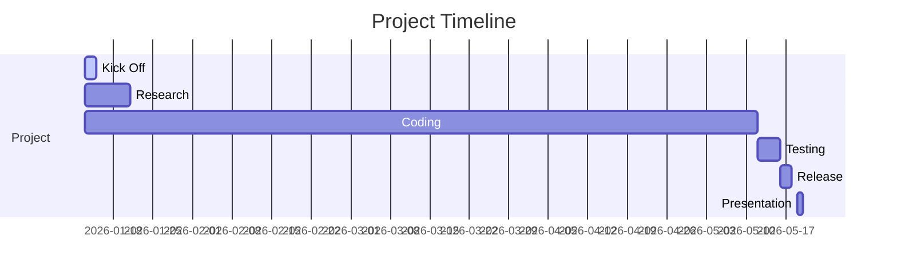
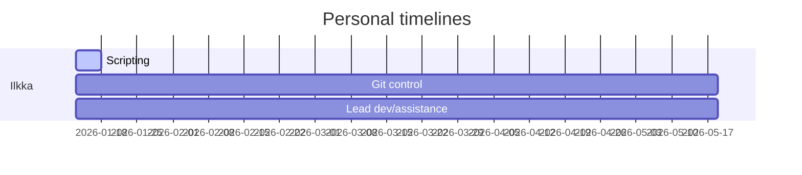
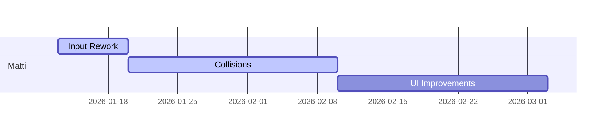

# Project plan - Eril

### __[See branch docs for faster updates](../../tree/docs/docs/ProjectPlan.md)__

## Goals
Our goal is to advance the Eril Project and create version 0.3.
Eril is a game engine previously developed by Ilkka Takala. It has most of the basic functionality, but requires much work to be called complete. 

Feature list of Eril v0.2
* OpenGL renderer (Forward+ pipeline with blended transparency)
* Instanced objects
* Technical support for 1k dynamic lights
* Shaders, materials, textures
* Garbage collection, reference counting
* Transformable objects
* Modular design
* Scene graph and levels
* Console with custom logs
* Audio System with ECS
* UI Framework
* Entity-Component-System framework
* Collisions

## Team and Responsibilities

Final Responsibilities

| Name   | Task |
| ---    | ---  |
| Ilkka  | Project lead, design, General programming |
| Matti | Programming |

## Features

These are the features we will add on top of the existing features:
* Input system rework
* Scripting
* SSAO
* Reflections
* Shadows
* Animations
* Editors
* UI Framework improvements
* Collisions

Addidional features if required features are finished:
* Networking
* Level editor
* CMake/Custom build system
* Custom file types
* LODs

## Timeline

