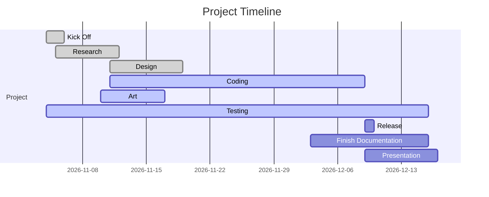
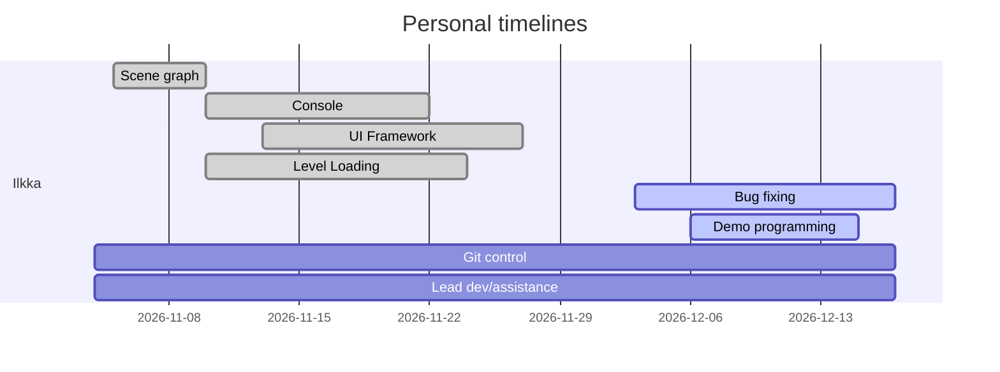
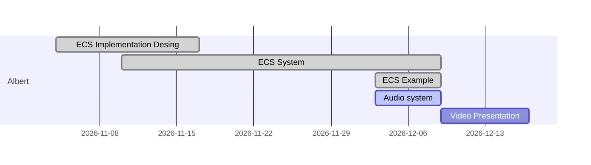
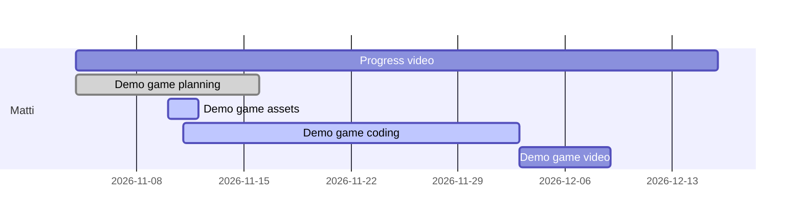
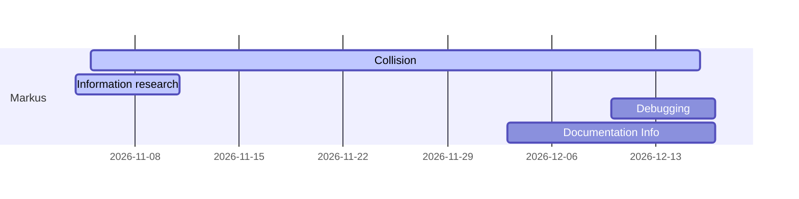
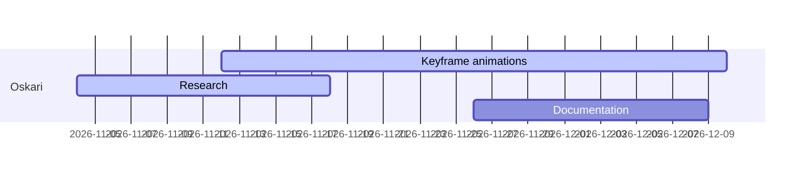
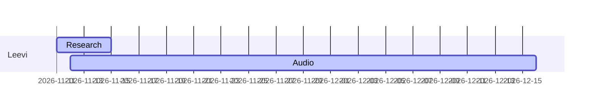

# Project plan - Eril

### __[See branch docs for faster updates](../../tree/docs/docs/ProjectPlan.md)__

## Goals
Our goal is to advance the Eril Project and create version 0.2.
Eril is a game engine previously developed by Ilkka Takala. It has most of the basic functionality, but requires much work to be called complete. 

Feature list of Eril v0.1
* OpenGL renderer (Forward+ pipeline with blended transparency)
* Instanced objects
* Technical support for 1k dynamic lights
* Shaders, materials, textures
* Garbage collection, reference counting
* Transformable objects
* Modular design

## Team and Responsibilities

| Name   | Task |
| ---    | ---  |
| Ilkka  | Project lead, design, programming |
| Albert | Producer, programming |
| Matti  | Demo design, programming |
| Susanne| Documentation, design assistant, bug fixing |
| Markus | Research, programming |
| Oskari | UI workflow design |
| Leevi | Audio framework |

**Updated responsibilities**

| Name   | Task |
| ---    | ---  |
| Ilkka  | Project lead, design, programming |
| Albert | Producer, programming |
| Matti  | Demo design, programming |
| Markus | Research, collision programming |
| Oskari | Compiler warning fixing |
| Leevi | Audio system |

## Features

These are the features we will add on top of the existing features:
* Scene graph and levels
* Console with custom logs
* Audio
* UI 
* Entity-Component-System framework
* Collisions

Addidional features:
* Networking
* Scripting
* Level editor in Blender

## Timeline

